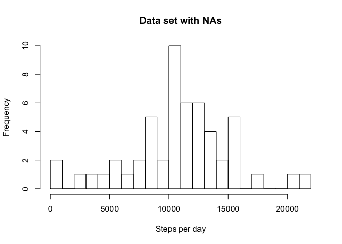

# Reproducible Research: Peer Assessment 1


## Loading and preprocessing the data

```r
Data <- read.csv("activity.csv", header=TRUE, sep=",", na.strings = "NA")
```

## What is mean total number of steps taken per day?


```r
Data_per_day <- Data %>%
        group_by(date) %>%
        summarize(per_day= sum(steps))

hist(Data_per_day$per_day, breaks=20, main= "Data set with NAs", xlab = "Steps per day")
```

<!-- -->

```r
mean_steps <- mean(Data_per_day$per_day, na.rm=TRUE)
median_steps <- median(Data_per_day$per_day, na.rm=TRUE)
```
The mean of the total number of steps per day is 1.0766189\times 10^{4} and the median 10765.

## What is the average daily activity pattern?


```r
Dataplot <- Data %>% group_by(interval) %>% summarise(Avg=mean(steps, na.rm=TRUE))
with(Dataplot, plot(interval, Avg, type="l"))
```

<!-- -->

```r
interval <- with(Dataplot, Dataplot[Avg==max(Avg, na.rm=TRUE),]$interval)
Avg <- with(Dataplot, Dataplot[Avg==max(Avg, na.rm=TRUE),]$Avg)
```

The 5-minute interval that contains the maximum number of steps on average across all the days in the dataset is 835, with 206.1698113 number of steps.

## Imputing missing values


```r
NA_lines <- sum(is.na(Data$steps))

#Will replace NA values by the mean of the steps by inteval
replace.na.mean <- function(x) replace(x, is.na(x), mean(x, na.rm = TRUE))
Data_nna <- Data %>%
                group_by(interval) %>%
                mutate(steps.no.NA=replace.na.mean(steps))

Data_per_day_nna <- Data_nna %>%
        group_by(date) %>%
        summarize(per_day= sum(steps.no.NA))

#plot histogram
hist(Data_per_day_nna$per_day, breaks=20, main= "Data set with no NAs \n RED color is the original histogram", xlab = "Steps per day")    
hist(Data_per_day$per_day, breaks=20,col="red", add=TRUE)
```

<!-- -->

```r
#producing the mean and the median to compare to previous data
mean_steps1 <- mean(Data_per_day_nna$per_day, na.rm=TRUE)
median_steps1 <- median(Data_per_day_nna$per_day, na.rm=TRUE)
```

The total number of NAs in the data set are 2304
NAs will be replace by the mean of the steps in the respective interval

The mean of the total number of steps per day is 1.0766189\times 10^{4} and the median 1.0766189\times 10^{4}.  Not significatly different from the initial results.


## Are there differences in activity patterns between weekdays and weekends?


```r
#Create a new factor variable in the dataset with two levels – “weekday” and “weekend” indicating whether a given date is a weekday or weekend day.

Data_nna$DayType <- factor((weekdays(as.Date(Data_nna$date)) %in% c("Monday", "Tuesday", "Wednesday", "Thursday", "Friday")), levels=c(FALSE, TRUE), labels=c('Weekend', 'Weekday'))
         
Dataplot2 <- Data_nna %>% group_by(interval,DayType) %>% summarise(Avg=mean(steps, na.rm=TRUE))

with(Dataplot2, xyplot(Avg~interval | DayType , type="l", layout=(c(1,2))))
```

<!-- -->


